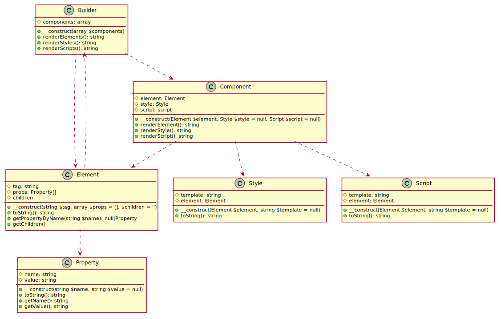

# Architecture

SSR Components is designed with the following model in mind:

-   Builder, takes care of rendering components, elements or strings.
    -   Component, the main entry point for developers. This part of the system contains an Element and may contain a Style and/or Script.
        -   Element, used for representing a DOM element.
            -   Property, converts the properties of an element to a renderable string.
        -   Style, used to customize the styling of the element with CSS.
        -   Script, used to customize the interactivity of the element via JavaScript.

## Class diagram

The key philosophy for achieving and maintaining the model is the use of recursion. Have a look at the following diagram to help understand how this might work:



<details>
<summary>Show source code of diagram...</summary>

```plantuml:main-class-diagram
class Builder {
    # components: array
    + __construct(array $components)
    + renderElements(): string
    + renderStyles(): string
    + renderScripts(): string
}

class Component {
    # element: Element
    # style: Style
    # script: script
    + __construct(Element $element, Style $style = null, Script $script = null)
    + renderElement(): string
    + renderStyle(): string
    + renderScript(): string
}

class Element {
    # tag: string
    # props: Property[]
    # children
    + __construct(string $tag, array $props = [], $children = '')
    + toString(): string
    + getPropertyValue(string $name): null|string
    + setPropertyValue(string $name, string $value = null): void
    + getChildren()
}

class Property {
    # name: string
    # value: string
    + __construct(string $name, string $value = null)
    + toString(): string
    + getName(): string
    + getValue(): string
}

class Style {
    # template: string
    # element: Element
    + __construct(Element $element, string $template = null)
    + toString(): string
}

class Script {
    # template: string
    # element: Element
    + __construct(Element $element, string $template = null)
    + toString(): string
}

Builder ..> Component
Builder ..> Element
Component ..> Element
Component ..> Style
Component ..> Script
Element ..> Property
Element ..> Builder

@enduml
```

</details>

As you can see the Element class depends on the Builder class, this is because when the Element has children in the shape of a Builder then it renders the children via the Builder.
